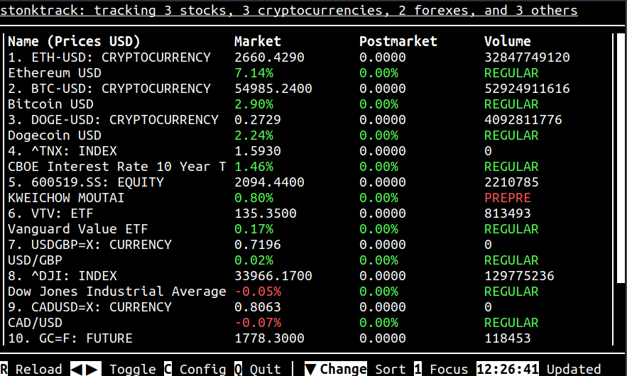
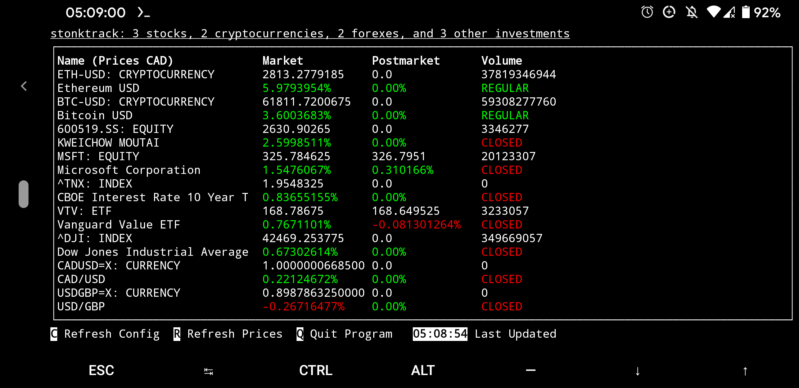
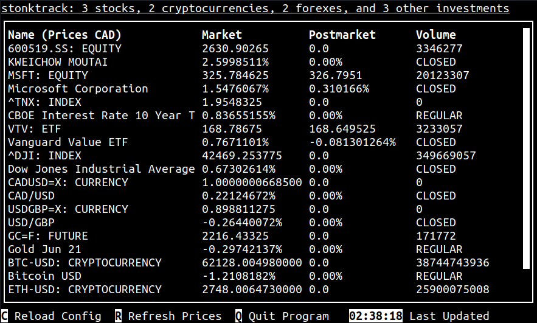

# stonktrack


Stonktrack is a terminal utility that can track stocks, cryptocurrencies, forexes, and more. Built with Python and urwid, it's different from other terminal finance trackers in that it can track a variety of assets, fetches  non-delayed real-time data, and does not require an API key. Stocktrack can also automatically convert prices into your local currency.

## Getting Started

### Installing and Running
This program can be installed in two different ways. You can install it directly with pip (recommended), or clone the repository and run the code yourself. Either way, you will need Python 3.6 or higher to run the code.

#### Using Pip
```
$ pip3 install stonktrack
$ nano config.yml
$ python3 -m stonktrack
```

#### Manually
```
$ git clone https://github.com/slightlyskepticalpotat/stonktrack.git
$ cd stonktrack
$ pip3 install -r requirements.txt
$ nano config.yml
$ python3 stonktrack.py
```

### Usage
Stonktrack is configured through a single configuration file named `config.yml`. Configuration options are explained in [CONFIG.md](CONFIG.md), and a sample configuration file is provided in [config.yml](config.yml).

## Screenshots

> Normal stonktrack, with colour and a scrollbar

---


> Stonktrack even works on mobile with Termux

---


> Monochrome mode isn't very colourful

## Contributing
Bug reports, forks, and pull requests are all welcome. Feel free to open an issue!

## Licence
This project is licensed under the GNU Affero General Public License v3.0. For more information, please refer to [LICENSE.md](LICENSE.md).
